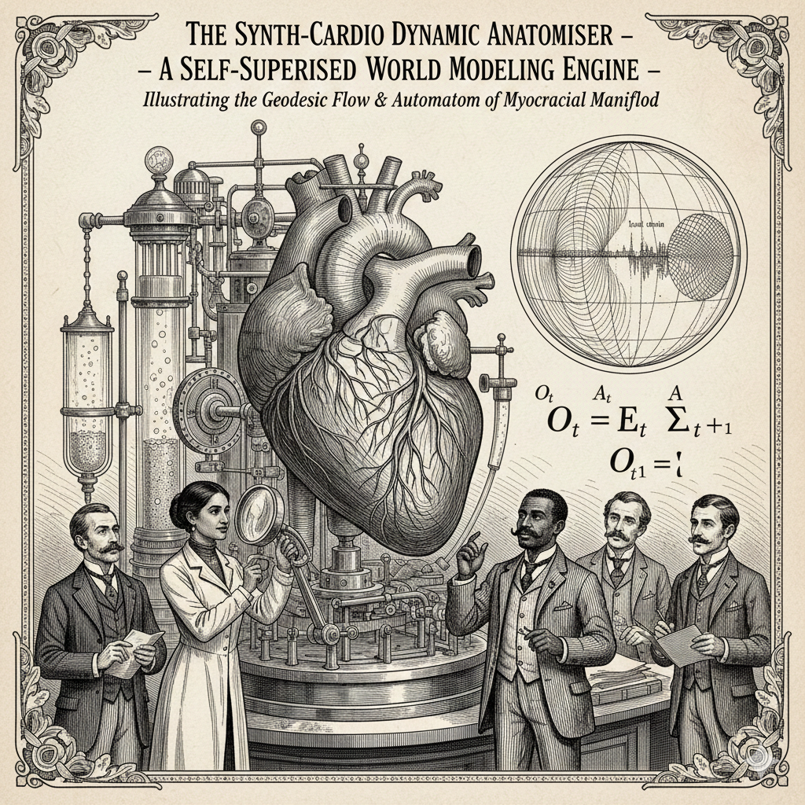

# Geometric Cardio SSWM: Self-Supervised World Models for Cardiac Mechanics.  

A comprehensive implementation of **Self-Supervised World Models (SSWMs) with geometric priors applied to cardiac biomechanics.** This package demonstrates how differential geometry, group theory, and topological concepts can be integrated into machine learning models for understanding and predicting cardiac dynamics.
 
---

---
## Overview

This project explores the intersection of:
- **Self-Supervised World Models (SSWMs)**: Predictive models that learn latent representations of dynamical systems
- **Geometric Priors**: Incorporating SO(3), E(3), and SE(3) group actions into neural architectures
- **Cardiac Mechanics**: Modeling the complex fiber architecture and deformation patterns of the human heart

---
### See also:
* [Why SSWMs Are in the News (2025)](./docs/importance-of-world-models.md) 🚨
---

### Key Concepts

The framework is built on three mathematical foundations:

1. **Group Theory**: Actions of transformation groups (rotations, translations) in latent space
2. **Differential Geometry**: Riemannian metrics, geodesics, and fiber bundle structures on cardiac manifolds
3. **Topology**: Persistent homology and structural decomposition of cardiac geometry

## Architecture

The SSWM consists of three main components:

```
Observation O_t → [Encoder E] → Latent State z_t
                                      ↓
                         [Dynamics Model f] ← Action A_t
                                      ↓
                         Predicted State z_t+1
                                      ↓
                         [Decoder D] → Predicted Observation Ô_t+1
```

### Components

1. **Encoder (E)**: Maps point cloud observations to latent representations
   - Input: Point clouds with geometric features (positions, fiber orientations)
   - Output: Compressed latent vectors capturing cardiac state
   - Architecture: PointNet-style permutation-invariant processing

2. **Dynamics Model (f)**: Predicts latent state evolution under actions
   - Input: Current latent state z_t and action A_t (strain tensor)
   - Output: Next latent state z_t+1
   - Architecture: GRU with geometric constraint preservation

3. **Decoder (D)**: Reconstructs observations from latent predictions
   - Input: Predicted latent state z_t+1
   - Output: Predicted point cloud with updated features
   - Architecture: MLP with folding operation

## The SynthCardio Dataset

The synthetic cardiac dataset represents the heart wall as:
- **Point clouds**: N points representing tissue locations
- **Fiber orientations**: Unit vectors indicating muscle fiber directions
- **Strain tensors**: 3×3 matrices capturing local deformation
- **Mechanical features**: Computed strain invariants and fiber-specific metrics

### Data Structure

Each observation consists of:
```
O_t = {
    positions: (N, 3),      # 3D coordinates
    fibers: (N, 3),         # Fiber orientation vectors
    features: (N, K)        # Strain invariants and fiber metrics
}
```

## A Note on Geometric Simplifications 🐄

Following the proud physics tradition of the ["spherical cow"](https://en.wikipedia.org/wiki/Spherical_cow) assumption, we begin with a **cylindrical heart**.

For those unfamiliar: physicists are famous for making wildly simplifying assumptions to make problems mathematically tractable. The classic joke involves a dairy farmer with low milk production who consults a physicist. After weeks of calculation, the physicist presents the solution: "First, assume a spherical cow in a vacuum..."

### Our "Cylindrical Heart" Assumption

The `SynthCardioDataGenerator` creates cardiac geometry as a cylindrical shell:
- **Inner radius** (endocardium): 0.4
- **Outer radius** (epicardium): 0.6  
- **Height**: 1.0
- **Coordinate system**: (θ, z, r) - cylindrical

### What We're Simplifying Away

A real left ventricle is:
- ✗ Roughly ellipsoidal/bullet-shaped (not cylindrical)
- ✗ Has complex regional curvature variations
- ✗ Includes papillary muscles and trabeculae
- ✗ Has spatially-varying wall thickness
- ✗ Connected to valves, atria, and other chambers
- ✗ Subject to boundary conditions from surrounding tissue

### Why This Is Still Valid

Despite these simplifications, our cylinder captures the **essential geometric features**:
- ✓ Transmural fiber rotation (-60° to +60° from endo to epi)
- ✓ Wall thickness and radial structure
- ✓ Cylindrical/axial symmetry
- ✓ The mathematical structure of strain on a curved manifold
- ✓ Point cloud representation suitable for real data

**Real cardiac modeling** does eventually move to patient-specific geometries reconstructed from MRI/CT imaging. But "assume a cylindrical heart" is a perfectly valid starting point for:
- Proof-of-concept implementations
- Algorithm development and testing
- Understanding the core mathematical machinery
- Synthetic data generation for training

Think of it as the cardiac equivalent of training on MNIST before tackling ImageNet. We're establishing the framework with clean geometry before adding the messy reality of actual hearts.

### Future Extensions

Moving beyond the cylinder:
- **Ellipsoidal geometry**: More realistic ventricular shape
- **Patient-specific meshes**: From medical imaging
- **Multi-chamber models**: Full heart geometry
- **Coupled systems**: Including blood flow and electrical activation

But for now: assume a cylindrical heart, and enjoy the tractable mathematics! 🫀📐

## Geometric Priors

### Fiber Bundle Structure

The cardiac geometry is modeled as a fiber bundle:
- **Base manifold M**: The 3D curved surface of the heart wall
- **Fiber F**: The space of possible fiber orientations at each point
- **Total space E**: The combined space M × F

### Riemannian Metric

A custom metric tensor G(z) is learned to capture:
- **Distance between states**: How far apart two cardiac configurations are
- **Geodesic paths**: The natural paths of cardiac deformation
- **Curvature**: The intrinsic geometry of the state space

### Group Actions

Transformation groups act on the latent space:
- **SO(3)**: Rotations of fiber orientations
- **E(3)**: Euclidean transformations of point positions
- **Strain group**: Symmetric positive-definite deformations

## Installation

### Requirements

```bash
python >= 3.8
torch >= 1.12.0
numpy >= 1.21.0
matplotlib >= 3.5.0
scipy >= 1.7.0
```

### Setup

```bash
# Clone or download the repository
cd geometric-cardio-sswm

# Run setup script
bash setup.sh

# Or install manually
pip install -r requirements.txt
```

## Usage

### Quick Start

```python
from src.sswm_model import SynthCardioSSWM
from src.data_generator import SynthCardioDataGenerator

# Create synthetic data
data_gen = SynthCardioDataGenerator(n_points=100, n_samples=1000)
train_data = data_gen.generate()

# Initialize model
model = SynthCardioSSWM(
    n_points=100,
    latent_dim=32,
    hidden_dim=64
)

# Train
from src.training import train_sswm
train_sswm(model, train_data, epochs=100)
```

### Jupyter Notebooks

Explore the concepts interactively:

1. **01_geometric_priors.ipynb**: Introduction to group theory and differential geometry
2. **02_synthcardio_data.ipynb**: Understanding the synthetic cardiac dataset
3. **03_sswm_architecture.ipynb**: Deep dive into the model components
4. **04_training_demo.ipynb**: Training the SSWM from scratch
5. **05_visualization.ipynb**: Visualizing latent space and predictions

## Project Structure

```
geometric-cardio-sswm/
├── README.md                    # This file
├── requirements.txt             # Python dependencies
├── setup.sh                     # Installation script
├── docs/
│   ├── mathematical_background.md
│   ├── architecture_details.md
│   └── training_guide.md
├── src/
│   ├── __init__.py
│   ├── encoder.py              # SSWM Encoder
│   ├── dynamics_model.py       # Dynamics Model
│   ├── decoder.py              # SSWM Decoder
│   ├── sswm_model.py           # Full SSWM Architecture
│   ├── data_generator.py       # SynthCardio Data Generator
│   ├── geometric_utils.py      # Geometric computation utilities
│   ├── training.py             # Training loop and losses
│   └── visualization.py        # Plotting and visualization
├── notebooks/
│   ├── 01_geometric_priors.ipynb
│   ├── 02_synthcardio_data.ipynb
│   ├── 03_sswm_architecture.ipynb
│   ├── 04_training_demo.ipynb
│   └── 05_visualization.ipynb
└── img/                        # Generated figures and diagrams
```

## Mathematical Background

### Fiber Architecture

The heart wall (myocardium) consists of muscle fibers organized in complex helical patterns. These fibers:
- Rotate progressively from endocardium to epicardium (-60° to +60°)
- Form a left-handed helix in the subendocardium
- Transition to circumferential at mid-wall
- Form a right-handed helix in the subepicardium

### Strain Tensor Decomposition

The Cauchy-Green strain tensor $C = F^T F$ captures local deformation:

```
C = [C_11  C_12  C_13]
    [C_21  C_22  C_23]
    [C_31  C_32  C_33]
```

Key invariants:

- **$I_1 = \text{tr}(C)$**: First invariant (volume change)
- **$I_2 = \frac{1}{2}[(\text{tr } C)^2 - \text{tr}(C^2)]$**: Second invariant
- **$I_3 = \det(C)$**: Third invariant (incompressibility)
- **$I_4 = f^T C f$**: Fiber stretch ($f$ = fiber direction)

### Geodesic Interpolation

In the latent space with metric $G(z)$, the geodesic between $z_A$ and $z_B$ satisfies:

$$\frac{d^2z^i}{d\lambda^2} + \Gamma^i_{jk} \frac{dz^j}{d\lambda}\frac{dz^k}{d\lambda} = 0$$

where $\Gamma^i_{jk}$ are Christoffel symbols of the metric connection.

## Training

The model is trained using a composite loss function:

```python
L_total = L_reconstruction + β·L_KL + α·L_geometric + γ·L_constraint
```

Where:
- **L_reconstruction**: MSE between predicted and true observations
- **L_KL**: KL divergence for VAE regularization
- **L_geometric**: Encourages geodesic structure in latent space
- **L_constraint**: Enforces physical constraints (incompressibility, fiber orientation)

### Hyperparameters

```python
latent_dim = 32          # Dimension of latent space
hidden_dim = 64          # Hidden units in dynamics model
learning_rate = 1e-3     # Adam optimizer learning rate
batch_size = 32          # Training batch size
epochs = 100             # Training epochs
beta = 0.001             # KL loss weight (VAE regularization)
alpha = 0.1              # Geometric loss weight
gamma = 0.05             # Constraint loss weight
```

## Visualization

The package includes tools for:
- **Latent space visualization**: t-SNE/UMAP projections of learned representations
- **Geodesic paths**: Comparing linear vs. geodesic interpolation
- **Fiber orientation fields**: Visualizing predicted fiber architectures
- **Deformation sequences**: Animating predicted cardiac motion
- **Strain heatmaps**: Displaying local strain distributions

## Key Results

The trained SSWM demonstrates:

1. **Disentanglement**: Separate latent dimensions for position, orientation, and strain
2. **Group structure**: Latent transformations respect SO(3) closure properties
3. **Physical plausibility**: Predictions satisfy incompressibility and fiber constraints
4. **Generalization**: Accurate predictions on held-out deformation patterns

## Applications

This framework can be extended to:
- **Patient-specific modeling**: Learning individual cardiac geometries and mechanics
- **Disease detection**: Identifying abnormal strain patterns
- **Surgical planning**: Predicting outcomes of interventions
- **Digital twins**: Real-time cardiac state estimation

## References

### Core Papers

1. Ha & Schmidhuber (2018). "World Models." arXiv:1803.10122
2. Hafner et al. (2019). "Learning Latent Dynamics for Planning from Pixels." ICML
3. Cohen & Welling (2016). "Group Equivariant Convolutional Networks." ICML

### Cardiac Mechanics

4. Streeter et al. (1969). "Fiber Orientation in the Canine Left Ventricle during Diastole and Systole." Circulation Research
5. Holzapfel & Ogden (2009). "Constitutive modelling of passive myocardium." Philosophical Transactions of the Royal Society A

### Geometric Deep Learning

6. Bronstein et al. (2021). "Geometric Deep Learning: Grids, Groups, Graphs, Geodesics, and Gauges." arXiv:2104.13478
7. Qi et al. (2017). "PointNet: Deep Learning on Point Sets for 3D Classification and Segmentation." CVPR

## Contributing

This is a research implementation exploring novel architectures. Contributions welcome:
- Bug fixes and improvements
- Additional geometric priors
- Extended cardiac mechanics models
- Visualization enhancements

## License

MIT License - see LICENSE file for details

## Authors

Based on collaborative discussions exploring the intersection of geometric deep learning and cardiac biomechanics.

## Citation

If you use this code in your research, please cite:

```bibtex
@software{geometric_cardio_sswm,
  title={Geometric Cardio SSWM: Self-Supervised World Models for Cardiac Mechanics},
  author={Ian Buckley},
  year={2025},
  url={https://github.com/roguetrainer/geometric-cardio-sswm}
}
```

## Acknowledgments

- Concepts derived from discussions on geometric priors in SSWMs
- Cardiac mechanics insights from computational cardiology literature
- PyTorch implementation leveraging modern deep learning best practices
